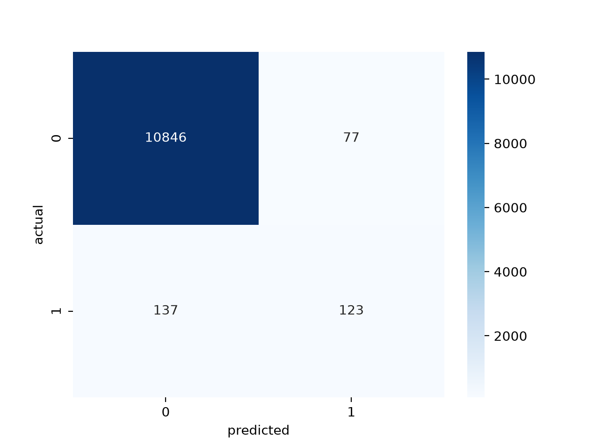

# Pull Request

## Related Issue

Closes #

---

## Task Summary

- **What did you implement?** Implemented an unsupervised anomaly detection system using the Isolation Forest algorithm to flag anomalous shuttle flights.
- **What approach did you follow?** Followed an experimental approach: established a baseline with default parameters, analyzed the see-saw trade-off between Precision and Recall by adjusting strictness parameters, tested feature scaling, and ultimately executed an automated Grid Search to locate the optimal safety configuration.

---

## Dataset

- [ ] Mammography
- [x] Shuttle

Dataset Source:

---

## Preprocessing

- There were no missing values in the dataset.
- **Feature Scaling Evaluation:** We integrated data standardization using `StandardScaler` to evaluate the model's sensitivity to feature magnitudes. The experiments successfully validated that the Isolation Forest algorithm is inherently scale-invariant. Because the model relies on recursive, axis-aligned isolation trees rather than geometric distance metrics, scaling preserves the exact relative separation paths of the anomalies. This is an exceptional characteristic for our pipeline, as it proves the model achieves peak predictive performance with reduced preprocessing overhead.

---

## Model Configuration

*(For best "Safety-First" model)*

| Hyperparameter | Value |
|---------------|-------|
| n_estimators | 100 |
| contamination | 0.50 |
| max_samples | 256 |
| max_features | 1.0 |
| random_state | 42 |

---

## Evaluation Results

| Metric | Value |
|--------|-------|
| Precision | 0.40 |
| Recall | 0.94 |
| F1-score | 0.56 |

---

## Visualizations

**Confusion Matrix — Best Safety Model**

**Impact of Contamination Threshold on Anomaly Recall**

---

## Key Observations

- **What worked well?** Increasing the `contamination` parameter significantly expanded the classification envelope, maximizing our Recall to 0.94 (catching 94% of shuttle system anomalies).
- **Which hyperparameter had the biggest impact?** `contamination` had the absolute biggest impact on shifting the see-saw balance between precision and recall.
- **Any interesting findings?** Increasing `n_estimators` beyond 200–300 resulted in diminishing returns and minor score degradation due to algorithmic plateauing. Furthermore, setting `contamination` too high combined with tiny sample sizes caused "swamping," where normal data points overwhelmed the trees' ability to isolate actual anomalies.
- **Challenges faced:** Overcoming short-term memory clears when switching kernel environments in VS Code, requiring structured notebook tracking.

---

## Checklist

- [x] Code runs successfully
- [x] Notebook (`.ipynb`) included
- [x] Code is well-commented
- [x] README/documentation updated
- [x] At least **2 plots** included
- [x] PR is linked to the corresponding issue
