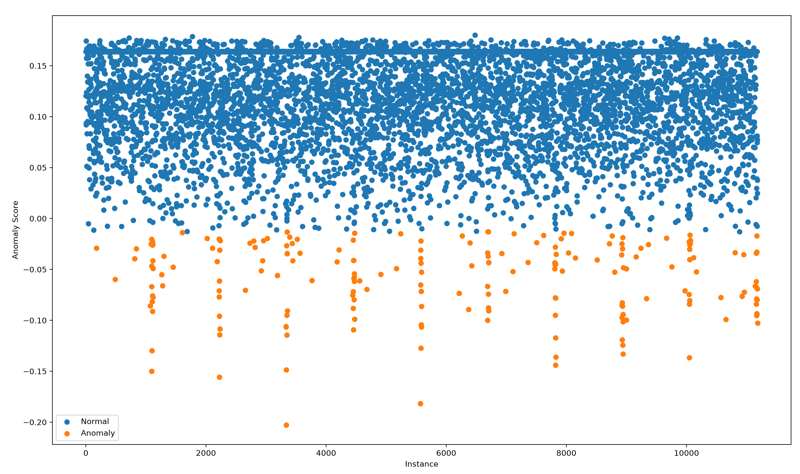

# Pull Request

## Related Issue

Closes # 12 

---

## Task Summary

Provide a brief overview of your implementation.

- What did you implement?
Implemented the Isolation Forest model for detecting anomalous mammography data

- What approach did you follow?

I extracted the data from a csv file,
selected the features to detect the anomaly
used dropna() to eliminate rows with missing values
used StandardScaler to scale features
split the data into test and train (test=0.1)
trained the isolation forest model
used iso_forest.predict() to get the number of anomaly
used matplotlib to plot the data

---

## Dataset

- [x] Mammography
- [ ] Shuttle

Dataset Source: OpenML

---

## Preprocessing

Handled missing values with pandas' built in function df.dropna()
which drops rows with NaN

Found out using SHAP, that col 4/5/6 were the major contributors to the model and rest of the columns were just noise, omitting col 1/2/3 increased f1_score drastically

Omitted using Standard Scaler as the the data was already scaled

---

## Model Configuration

List the important hyperparameters used.

| Hyperparameter | Value |
|---------------|-------|
| n_estimators | 100 |
| contamination | 0.023 |
| max_samples | 256 |
| max_features | 3 |
| random_state | 42 |

---

## Evaluation Results

| Metric | Value |
|--------|-------|
| Precision |0.615|
| Recall |0.473|
| F1-score |0.535|
| ROC-AUC (Optional) | |

---

## Visualizations

Attach **at least 2 plots** from your analysis.
---
**Confusion Matrix**

---
**Scatter Plot**

---

---

## Key Observations

Briefly summarize:

- What worked well?\
The most important function that helped tune the model better was precision_recall_curve(), which helped me know the exact threshold value, instead of blindly going for predict()

- Which hyperparameter had the biggest impact?\
3 Main hyperparameters **Contamination|n_estimators|max_samples** had high impacts on f1score, especially **Contamination** and **max_features**
- Any interesting findings?\

- Challenges faced (if any)\
Most of the challenge faced was getting familiar with the syntax of different libraries, and researching how to improve the f1_score took a lot of time
initial f1_score: 0.264 
final f1_score: 0.535

Understanding how to evaluate the model (i.e implementing the precision_score etc) was a big challenge due to different conventions among OpenML|Isolation_Forest|Precision_Score

---

## Checklist

- [x] Code runs successfully
- [ ] Notebook (`.ipynb`) included
- [x] Code is well-commented
- [x] README/documentation updated
- [x] At least **2 plots** included
- [x] PR is linked to the corresponding issue