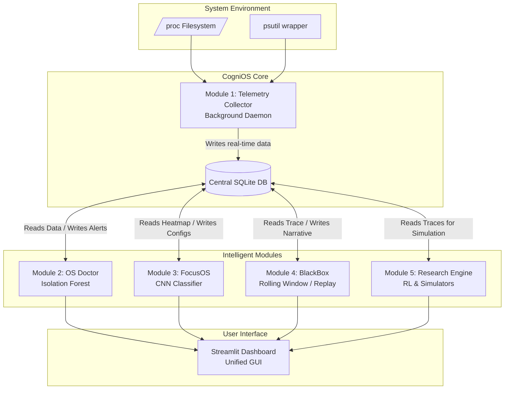

# CogniOS - Archietecture diagram 

```mermaid
graph TD
    subgraph System Environment
        proc[/proc Filesystem/]
        psutil[psutil wrapper]
    end

    subgraph CogniOS Core
        DB[(Central SQLite DB)]
        TC[Module 1: Telemetry Collector\nBackground Daemon]
        
        TC -->|Writes real-time data| DB
        proc --> TC
        psutil --> TC
    end

    subgraph Intelligent Modules
        OD[Module 2: OS Doctor\nIsolation Forest]
        FO[Module 3: FocusOS\nCNN Classifier]
        BB[Module 4: BlackBox\nRolling Window / Replay]
        RE[Module 5: Research Engine\nRL & Simulators]
    end

    DB <-->|Reads Data / Writes Alerts| OD
    DB <-->|Reads Heatmap / Writes Configs| FO
    DB <-->|Reads Trace / Writes Narrative| BB
    DB <-->|Reads Traces for Simulation| RE

    subgraph User Interface
        DASH[Streamlit Dashboard\nUnified GUI]
    end

    OD --> DASH
    FO --> DASH
    BB --> DASH
    RE --> DASH
```
