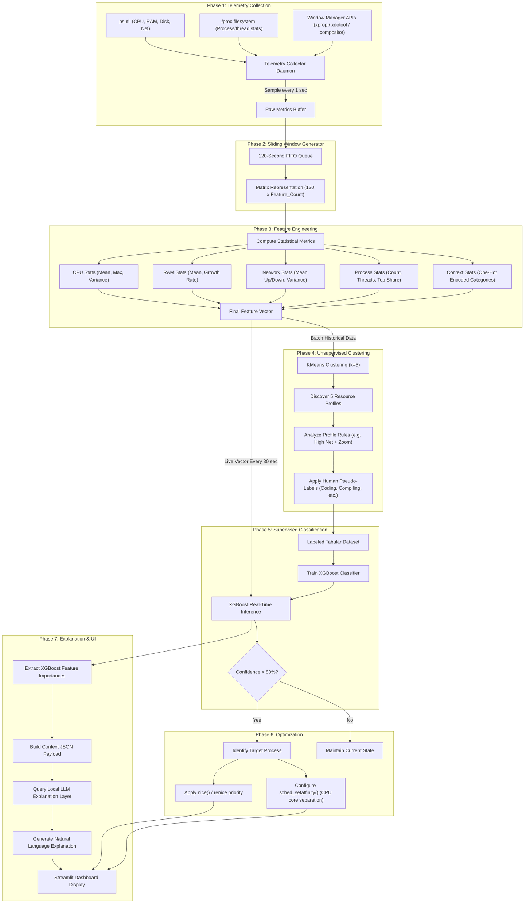

# CogniOS
Module FocusOS Detailed WorkFlow

```mermaid
graph TD
    subgraph Phase1["Phase 1: Telemetry Collection"]
        A1["psutil (CPU, RAM, Disk, Net)"] --> B1["Telemetry Collector Daemon"]
        A2["/proc filesystem (Process/thread stats)"] --> B1
        A3["Window Manager APIs (xprop / xdotool / compositor)"] --> B1
        B1 -->|Sample every 1 sec| C1["Raw Metrics Buffer"]
    end

    subgraph Phase2["Phase 2: Sliding Window Generator"]
        C1 --> D1["120-Second FIFO Queue"]
        D1 --> E1["Matrix Representation (120 x Feature_Count)"]
    end

    subgraph Phase3["Phase 3: Feature Engineering"]
        E1 --> F1["Compute Statistical Metrics"]
        F1 --> G1["CPU Stats (Mean, Max, Variance)"]
        F1 --> G2["RAM Stats (Mean, Growth Rate)"]
        F1 --> G3["Network Stats (Mean Up/Down, Variance)"]
        F1 --> G4["Process Stats (Count, Threads, Top Share)"]
        F1 --> G5["Context Stats (One-Hot Encoded Categories)"]
        G1 & G2 & G3 & G4 & G5 --> H1["Final Feature Vector"]
    end

    subgraph Phase4["Phase 4: Unsupervised Clustering"]
        H1 -->|Batch Historical Data| I1["KMeans Clustering (k=5)"]
        I1 --> J1["Discover 5 Resource Profiles"]
        J1 --> K1["Analyze Profile Rules (e.g. High Net + Zoom)"]
        K1 --> L1["Apply Human Pseudo-Labels (Coding, Compiling, etc.)"]
    end

    subgraph Phase5["Phase 5: Supervised Classification"]
        L1 --> M1["Labeled Tabular Dataset"]
        M1 --> N1["Train XGBoost Classifier"]
        H1 -->|Live Vector Every 30 sec| O1["XGBoost Real-Time Inference"]
        N1 --> O1
        O1 --> P1{"Confidence > 80%?"}
    end

    subgraph Phase6["Phase 6: Optimization"]
        P1 -->|Yes| Q1["Identify Target Process"]
        P1 -->|No| Q2["Maintain Current State"]
        Q1 --> R1["Apply nice() / renice priority"]
        Q1 --> R2["Configure sched_setaffinity() (CPU core separation)"]
    end

    subgraph Phase7["Phase 7: Explanation & UI"]
        O1 --> S1["Extract XGBoost Feature Importances"]
        S1 --> T1["Build Context JSON Payload"]
        T1 --> U1["Query Local LLM Explanation Layer"]
        U1 --> V1["Generate Natural Language Explanation"]
        V1 --> W1["Streamlit Dashboard Display"]
        R1 --> W1
        R2 --> W1
    end
```
