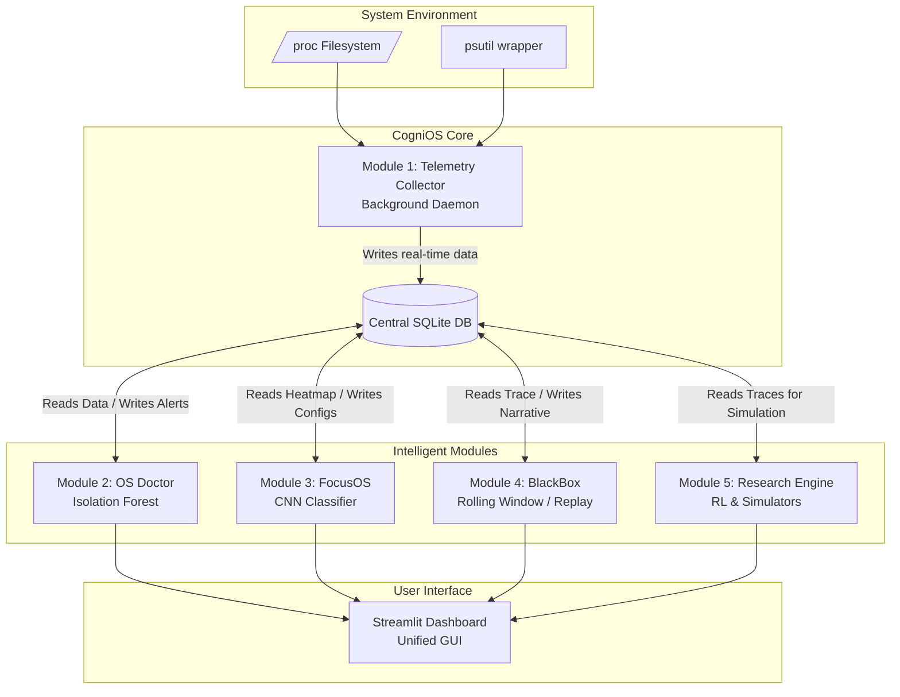
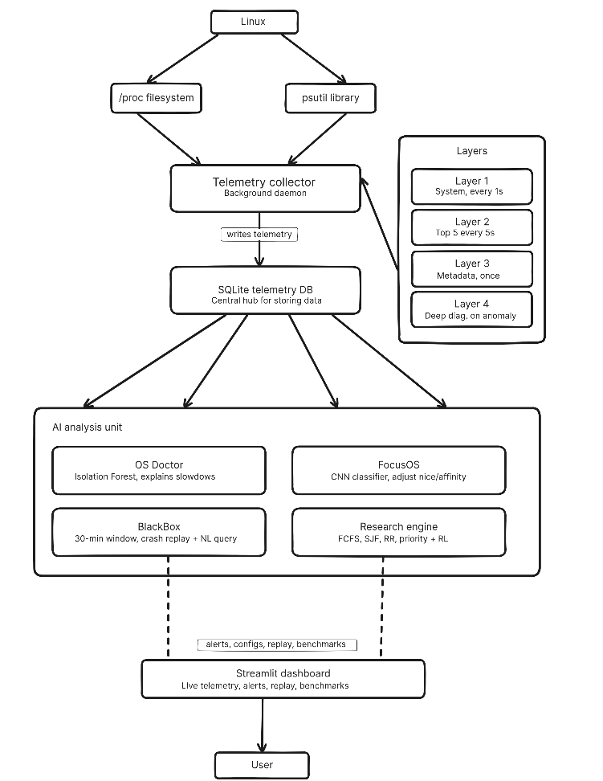

# CogniOS - Architecture diagram 

# CogniOS

### Intelligent OS Observability & Adaptive Workload Optimization Platform

> **CogniOS** is an AI-assisted Linux system observability and workload optimization platform that combines operating systems, machine learning, and systems engineering to provide intelligent performance monitoring, anomaly detection, workload-aware optimization, crash analysis, and scheduling research—all without modifying the Linux kernel.

---

## Overview

Modern operating systems expose a large amount of telemetry, but existing monitoring tools often present only raw statistics, leaving users to determine the root cause of performance issues themselves.

CogniOS bridges this gap by collecting real-time system telemetry, analyzing workload behavior, detecting anomalies, recommending optimizations, and enabling post-crash analysis through an integrated and modular architecture.

The project is designed as both:

- A practical system observability platform for Linux
- A research framework for experimenting with AI-assisted operating system scheduling

---

## Key Features

- 📊 Real-time Linux system telemetry collection
- 🩺 Intelligent anomaly detection for performance degradation
- 🎯 AI-based workload classification and optimization
- 📦 Rolling telemetry recording for crash replay
- 🔬 Scheduling algorithm benchmarking and research
- 📈 Interactive Streamlit dashboard
- 🗄️ Centralized SQLite telemetry database
- 🧩 Modular architecture for independent development and testing

---

# Architecture



---

# Core Modules

## 🩺 OS Doctor

OS Doctor continuously monitors the system for abnormal behavior using machine learning–based anomaly detection techniques.

### Objective

- Detect abnormal CPU, memory and I/O behavior
- Explain possible reasons for system slowdowns
- Identify unusual workload patterns
- Provide interpretable diagnostics from live telemetry

---

## 🎯 FocusOS

FocusOS is responsible for intelligent workload classification and adaptive system optimization.

### Objective

- Classify the current workload using machine learning
- Optimize process priorities
- Modify Linux scheduling parameters
- Improve overall system responsiveness

Future versions may also support dynamic CPU affinity optimization and workload-aware scheduling.

---

## 📦 BlackBox

BlackBox acts as the system's flight recorder.

It continuously stores recent telemetry in a rolling buffer, allowing developers to replay system activity after crashes or freezes.

### Objective

- Record recent system telemetry
- Preserve crash history
- Replay workload traces
- Assist in post-mortem debugging

---

## 🔬 Research Engine

The Research Engine provides an experimentation platform for scheduling algorithms.

### Objective

- Compare classical scheduling algorithms
- Evaluate AI-based schedulers
- Replay collected workloads
- Benchmark scheduling performance
- Support reinforcement learning experiments

Supported scheduling algorithms include:

- FCFS
- Shortest Job First
- Round Robin
- Priority Scheduling

Future versions may include reinforcement learning schedulers.

---

## 📊 Dashboard

The Streamlit dashboard serves as the unified visualization layer of CogniOS.

### Objective

- Visualize system telemetry
- Display anomaly alerts
- Monitor workload classifications
- Compare scheduling results
- Provide a centralized monitoring interface

---

## 📡 Collectors

Collectors gather telemetry directly from Linux using lightweight system interfaces.

### Objective

- CPU monitoring
- Memory monitoring
- Disk monitoring
- Process monitoring
- Network statistics
- I/O statistics

These collectors act as the data source for every other module.

---

## 🗄️ Data Layer

The data layer stores all telemetry generated by the collectors.

### Responsibilities

- Store real-time telemetry
- Maintain workload traces
- Persist crash recordings
- Provide data for ML training
- Support benchmarking experiments

SQLite is used as the centralized storage backend.

---

# Repository Structure

```
CogniOS/
│
├── blackbox/               # Rolling telemetry recorder and crash replay engine
├── collectors/             # System telemetry collectors using /proc and psutil
├── dashboard/              # Streamlit-based monitoring dashboard
├── data/
│   ├── datasets/           # Labeled workload datasets for ML training
│   ├── telemetry/          # Raw telemetry snapshots
│   └── sqlite/             # SQLite database files
├── focusos/                # AI workload classifier and adaptive optimization engine
├── os_doctor/              # Real-time anomaly detection module
├── research_engine/        # Scheduling simulator and benchmarking framework
├── utils/                  # Shared helper utilities used across modules
│
├── cognios_as_daemon.py    # Runs CogniOS as a background monitoring daemon
├── notifier.py             # Desktop notifications from the background daemon
├── config.py               # Global project configuration
├── db.py                   # SQLite database interface and helper functions
├── main.py                 # UI launcher (Streamlit in browser or Qt desktop window)
├── install.sh              # Linux system installer
├── uninstall.sh            # Linux uninstaller
├── overhead.py             # Measures runtime overhead introduced by monitoring
├── requirements.txt        # Python dependencies
└── README.md
```

---

# Technology Stack

| Category               | Technology                      |
| ---------------------- | ------------------------------- |
| Language               | Python                          |
| System Monitoring      | psutil, Linux `/proc`           |
| Database               | SQLite                          |
| Machine Learning       | PyTorch                         |
| Data Processing        | NumPy, Pandas                   |
| Anomaly Detection      | Isolation Forest (scikit-learn) |
| Reinforcement Learning | Stable-Baselines3               |
| Dashboard              | Streamlit                       |

---

# Getting Started

## Clone the Repository

```bash
git clone https://github.com/<your-org>/CogniOS.git
cd CogniOS
```

## Install on Linux (Fedora, Debian, Ubuntu)

The Linux installer installs CogniOS into `/opt/cognios`, creates a virtual
environment, installs required system and Python packages, adds the `cognios`
command and application-menu entry, and enables the telemetry daemon as a
systemd **user** service that starts at login.

From a cloned project directory, run:

```bash
cd CogniOS
sudo bash install.sh
```

Run the installer with `sudo` from your normal user account, not from a root
login. The installer uses that account as the service and file owner. It will
ask whether to start the daemon immediately; answer yes to start it without
logging out and back in.

The app can also be installed from a GitHub-hosted installer script. Replace
the repository URL if using a fork:

```bash
curl -fsSL https://raw.githubusercontent.com/devlup-labs/CogniOS/main/install.sh \
  | sudo env COGNIOS_REPO=devlup-labs/CogniOS bash
```

## Daemon and UI

CogniOS runs as two separate parts:

- **Background daemon:** `cognios_as_daemon.py` collects telemetry, runs the
  analysis workers, writes BlackBox data, and sends desktop notifications.
  The Linux installer manages it through `cognios` / systemd.
- **UI launcher:** `main.py` launches the Streamlit dashboard in a browser or
  Qt desktop window. It does not start the daemon.

After installation, open the desktop UI from the application menu or run:

```bash
cognios                  # Open the desktop UI (default)
cognios --ui desktop     # Open the desktop UI
cognios --ui browser     # Open the dashboard in a browser
```

Manage the background daemon and installation with:

```bash
cognios start            # Start the daemon now
cognios stop             # Stop the daemon until the next login
cognios restart          # Restart the daemon
cognios status           # Show daemon status
cognios logs             # Follow daemon logs
cognios update           # Download the latest main branch, update, and restart
cognios upgrade          # Alias for update
cognios uninstall        # Uninstall and back up databases and .env
cognios uninstall --purge  # Uninstall and remove application data
```

The service is enabled globally for user sessions. To disable automatic
startup at login while keeping the installation:

```bash
systemctl --global disable cognios.service
```

## Run from a clone (development)

`main.py` launches only the UI. The following setup runs the daemon in the
foreground separately from the dashboard:

```bash
python3 -m venv .venv
source .venv/bin/activate       # Windows: .venv\Scripts\activate
pip install -r requirements.txt

# Terminal 1: background telemetry and analysis workers
python cognios_as_daemon.py

# Terminal 2: UI (desktop by default)
python main.py
# Or choose browser mode
python main.py --ui browser
```

The `start.sh` and `start.bat` scripts set up the Python environment and launch
the UI only; they do not install or start the background daemon.

---

# Development Philosophy

Each major subsystem is designed as an independent module with its own documentation, enabling contributors to work on individual components without affecting the rest of the project.

Every module contains its own dedicated `README.md` describing:

- Module architecture
- Directory structure
- Components
- APIs
- Data flow
- Usage
- Future work

---

# Roadmap

- Real-time Linux telemetry collection
- Intelligent anomaly detection
- AI-assisted workload optimization
- Crash replay and forensic analysis
- Scheduling benchmark suite
- Reinforcement learning scheduler
- GPU telemetry support
- Windows and macOS support

---

# Contributing

We welcome contributions from developers interested in:

- Operating Systems
- Machine Learning
- Systems Programming
- Linux Internals
- Performance Engineering
- Data Engineering

Before contributing, please read the documentation for the module you wish to work on.

---

# License

This project is released under the MIT License.

---

# Acknowledgements

CogniOS is developed as an educational and research-focused project exploring the intersection of **Operating Systems**, **Artificial Intelligence**, and **Systems Engineering**.

The project aims to provide a modular platform for learning, experimentation, and innovation in intelligent system observability and workload optimization.
