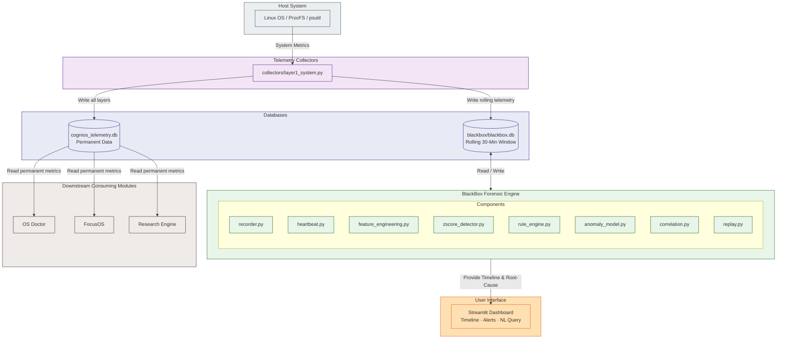

# BlackBox Module — CogniOS

> **"Airplane ka black box"** — continuously record karta rehta hai, crash/freeze ke baad replay karke batata hai exactly kya hua tha aur kyun.

---

## 1. Module Overview

BlackBox is CogniOS's **flight recorder and forensic analysis engine**. It answers one core question:

> _"My system froze/crashed — what happened in the 30 minutes before it?"_

### What BlackBox is

- A real-time telemetry recorder (rolling 30-minute window)
- An anomaly detection engine (Z-score + Isolation Forest)
- A root-cause explanation system (Correlation Engine + LLM)

### Core pipeline

```
Layer 1/2/3/4 Telemetry
        ↓
Rolling Event Store (last 30 min only)
        ↓
Heartbeat System (crash/freeze detection)
        ↓
Feature Engineering (120 rows → 1 feature vector)
        ↓
Z-score Detector (sudden spikes + slow drift)
        ↓
Isolation Forest (multi-metric anomaly confirmation)
        ↓
Rule Engine (deterministic backup checks)
        ↓
Correlation Engine (CAUSE → EFFECT chain)
        ↓
Replay Timeline
        ↓
LLM Explanation (human-readable root cause)
        ↓
Dashboard Alert
```

---

## 2. File Structure

```
blackbox/
├── recorder.py           # Rolling event store — writes + prunes telemetry
├── heartbeat.py          # Crash/freeze detection via heartbeat timestamps
├── feature_engineering.py # Converts raw DB rows → statistical feature vector
├── zscore_detector.py    # Z-score + slope (trend) based anomaly detector
├── anomaly_model.py      # Isolation Forest wrapper (sklearn)
├── rule_engine.py        # Deterministic threshold-based checks (backup)
├── correlation.py        # Builds CAUSE → EFFECT event chains
├── replay.py             # Reconstructs timeline from rolling window
├── nl_query.py           # Natural language query interface over crash data
```

```
utils/
├── config.py             # All BlackBox config constants
├── db.py                 # SQLite connection + schema helpers
└── helpers.py            # rate_mb_s() and other shared utilities
```

---

## 3. Function & Class Definitions

### `recorder.py`

```python
def get_blackbox_conn() -> sqlite3.Connection
```
**Purpose:** Opens and returns a connection to `blackbox/blackbox.db` in WAL mode with synchronous set to NORMAL for crash-safe, fast writes.
* **Input:** None
* **Output:** `sqlite3.Connection`

```python
def create_blackbox_table(conn: sqlite3.Connection) -> None
```
**Purpose:** Creates the rolling `blackbox_telemetry` table schema (for CPU, Memory, Disk, Network, Processes, and Hardware temperatures) if it doesn't already exist.
* **Input:** `conn` (sqlite3 connection)
* **Output:** None

```python
def write_telemetry(conn: sqlite3.Connection, metrics: dict) -> None
```
**Purpose:** Writes one Layer 1 metrics dictionary row into `blackbox_telemetry`. Inserts current time if timestamp is missing. Triggers database pruning (`prune_old_records`) every 60 writes.
* **Input:** `conn`, `metrics` (dict)
* **Output:** None

```python
def prune_old_records(conn: sqlite3.Connection) -> None
```
**Purpose:** Deletes telemetry rows older than `BLACKBOX_WINDOW_SEC` (default: 30 minutes) to maintain the rolling window.
* **Input:** `conn`
* **Output:** None

```python
def get_recent_rows(conn: sqlite3.Connection, n: int = 120) -> list[dict]
```
**Purpose:** Fetches the last `n` telemetry rows (default 120 = last 2 minutes), returning them in chronological order. Useful for feature engineering or correlation analysis.
* **Input:** `conn`, `n` (int)
* **Output:** `list[dict]`

```python
def get_window_rows(conn: sqlite3.Connection, start_time: float, end_time: float) -> list[dict]
```
**Purpose:** Fetches and returns all telemetry rows between two Unix epoch timestamps.
* **Input:** `conn`, `start_time` (float), `end_time` (float)
* **Output:** `list[dict]` ordered chronologically

```python
def row_count(conn: sqlite3.Connection) -> int
```
**Purpose:** Returns the total number of rows currently stored in `blackbox_telemetry`.
* **Input:** `conn`
* **Output:** `int`

---

### `heartbeat.py`

```python
def create_heartbeat_table(conn: sqlite3.Connection) -> None
```
**Purpose:** Creates a single-row table `blackbox_heartbeat` to store the last heartbeat timestamp and a graceful shutdown flag.
* **Input:** `conn`
* **Output:** None

```python
def update_heartbeat(conn: sqlite3.Connection) -> None
```
**Purpose:** Updates the `last_beat` column with the current timestamp. Called by the daemon loop every second.
* **Input:** `conn`
* **Output:** None

```python
def mark_graceful_shutdown(conn: sqlite3.Connection) -> None
```
**Purpose:** Sets the `graceful_shutdown` flag to `1` in the heartbeat table. Must be called in the daemon's SIGTERM/SIGINT handler to indicate a clean exit.
* **Input:** `conn`
* **Output:** None

```python
def check_crash_on_startup(conn: sqlite3.Connection) -> tuple[bool, float]
```
**Purpose:** Called once at daemon startup. Reads the last heartbeat timestamp and the graceful shutdown flag. Returns `(crash_detected: bool, gap_seconds: float)`. A crash is detected if `graceful_shutdown` was `0` and `gap > BLACKBOX_CRASH_GAP_SEC`. Resets `graceful_shutdown` to `0` for the new session.
* **Input:** `conn`
* **Output:** `(crash_detected, gap_seconds)`

---

### `feature_engineering.py`

```python
def extract_feature_vector(rows: list[dict]) -> list[float] | None
```
**Purpose:** Converts the last 120 raw telemetry rows into a single 8-dimensional statistical feature vector for anomaly detection.
* **Input:** `rows` (list of dicts, minimum 60 required)
* **Output:** `[mean_cpu, max_cpu, cpu_growth_rate, cpu_variance, mean_ram, memory_growth_rate, disk_spike_frequency, context_switch_rate]`. Returns `None` if data is insufficient.

---

### `zscore_detector.py`

```python
class ZScoreDetector:
```
**Purpose:** Sliding-window statistical detector that monitors metric streams for sudden spikes and slow drifts.
* **Methods:**
  * `__init__(self)`: Initializes the rolling baseline deques for Z-score calculation, slope calculation, and sustained spike filtering.
  * `update(self, val)`: Appends a new metric reading to the internal deques.
  * `warmup_pct(self)`: Returns calibration progress (0-100%).
  * `check(self, val, metric_name="metric", unit="%") -> list[dict]`: Checks for:
    * **Z-score spike:** Flags values exceeding `Z > 2.8` sustained for 30s.
    * **Slow drift:** Calculates the trend slope via linear regression. Flags slow drifts (e.g. memory leaks) and predicts `ETA to critical`.

---

### `anomaly_model.py`

```python
def train(normal_feature_vectors: list[list[float]], contamination: float = 0.05) -> IsolationForest
```
**Purpose:** Trains an Isolation Forest on normal baseline feature vectors.
* **Input:** `normal_feature_vectors` (list of feature lists), `contamination` (expected anomaly ratio)
* **Output:** Trained `IsolationForest` object

```python
def predict(model: IsolationForest, feature_vector: list[float]) -> tuple[int, float]
```
**Purpose:** Predicts if a feature vector is normal (`1`) or anomalous (`-1`), returning the label and raw decision score.
* **Input:** `model` (IsolationForest), `feature_vector` (list of 8 floats)
* **Output:** `(label, score)`

```python
def anomaly_severity(score: float) -> int
```
**Purpose:** Converts the raw Isolation Forest decision score (negative = more anomalous) to a normalized `0-100` severity integer for the dashboard.
* **Input:** `score` (float)
* **Output:** `int`

```python
def save_model(model: IsolationForest, path: str = MODEL_PATH) -> None
```
**Purpose:** Serializes and saves the trained model to disk using pickle.
* **Input:** `model` (IsolationForest), `path` (str)
* **Output:** None

```python
def load_model(path: str = MODEL_PATH) -> IsolationForest
```
**Purpose:** Loads a saved model from disk.
* **Input:** `path` (str)
* **Output:** `IsolationForest`

---

### `rule_engine.py`

```python
def check_rules(metrics: dict) -> list[dict]
```
**Purpose:** Runs deterministic limit checks (CPU, Memory, Zombies, Temperature, Swap) alongside ML models. Fills the gap during the model warmup period.
* **Input:** `metrics` (dict)
* **Output:** `list[dict]` of fired alerts

---

### `correlation.py`

```python
def telemetry_to_events(rows: list[dict]) -> list[dict]
```
**Purpose:** Analyzes telemetry rows and creates events (e.g., `cpu_spike`, `memory_growth`, `process_explosion`, `zombie_buildup`, `io_storm`, `swap_spike`) if thresholds are breached.
* **Input:** `rows` (list of dicts)
* **Output:** `list[dict]` of events

```python
def build_event_chain(events: list[dict]) -> list[dict]
```
**Purpose:** Deduplicates and groups events occurring close in time (within 5 seconds) to construct a clean cause-effect event chain.
* **Input:** `events` (list of dicts)
* **Output:** `list[dict]` (chronological event chain)

```python
def format_chain_text(chain: list[dict]) -> str
```
**Purpose:** Formats the event chain into a clean, human-readable timeline string.
* **Input:** `chain` (list of dicts)
* **Output:** `str`

---

### `replay.py`

```python
def replay(conn, crash_time: float = None, window_minutes: int = 30) -> dict
```
**Purpose:** Reconstructs the pre-crash system state by fetching telemetry rows, converting them to events, building the event chain, and formatting the timeline.
* **Input:** `conn` (sqlite3 connection), `crash_time` (Unix timestamp float), `window_minutes` (int)
* **Output:** `dict` containing crash details and timeline text

```python
def generate_llm_context(replay_result: dict, anomaly_type: str = "unknown") -> dict
```
**Purpose:** Creates a context dictionary containing a formatted prompt, timeline, and anomaly metadata to feed into the LLM for explanation generation.
* **Input:** `replay_result` (dict), `anomaly_type` (str)
* **Output:** `dict`

---

### `nl_query.py` & `crash_predictor_cnn.py`
* **Status:** These modules are currently placeholder drafts reserved for future development (natural language querying and CNN-based sequence classification) and do not contain active runtime functions.

---

## 4. Useful Telemetry Data

BlackBox consumes data from all 4 collector layers:

### From `layer1_system` (Layer 1 — every 1s)

| Column              | Use in BlackBox                         |
| ------------------- | --------------------------------------- |
| `cpu_usage_percent` | Primary Z-score metric, spike detection |
| `memory_percent`    | Memory leak slope detection             |
| `disk_read_mb_s`    | I/O storm detection                     |
| `net_rate_mb_s`     | Network exfiltration detection          |
| `cpu_ctx_switches`  | Scheduler congestion (feature vector)   |
| `total_processes`   | Thread explosion detection              |
| `zombie_processes`  | Zombie accumulation rule check          |
| `load_avg_1`        | Scheduler load feature                  |
| `swap_percent`      | Memory pressure feature                 |

### From `layer2_top_processes` (Layer 2 — every 5s)

| Column        | Use in BlackBox                                |
| ------------- | ---------------------------------------------- |
| `pid`, `name` | Identify culprit process in correlation engine |
| `cpu_percent` | Which process caused CPU spike                 |
| `rss_memory`  | Which process is leaking memory                |
| `timestamp`   | Timeline correlation                           |

### From `process_metadata` (Layer 3 — on first seen)

| Column        | Use in BlackBox                        |
| ------------- | -------------------------------------- |
| `cmdline`     | What exact command was running         |
| `exe_path`    | Where executable came from             |
| `username`    | Who launched the process               |
| `create_time` | When process started relative to crash |

### From `process_diagnostics` (Layer 4 — on anomaly)

| Column             | Use in BlackBox                          |
| ------------------ | ---------------------------------------- |
| `open_files_count` | File handle leak detection               |
| `thread_details`   | Which threads were consuming CPU         |
| `net_connections`  | Active network connections at crash time |
| `trigger_reason`   | Why Layer 4 was triggered                |

### Rolling window SQL

```sql
-- Fetch last 2 minutes for feature extraction
SELECT cpu_usage_percent, memory_percent,
       disk_read_mb_s, net_rate_mb_s,
       total_processes, cpu_ctx_switches
FROM layer1_system
ORDER BY timestamp DESC
LIMIT 120;

--Trim to 30-minute window
DELETE FROM telemetry
WHERE timestamp < (strftime('%s', 'now') - 1800);
```

---

## 5. Additional Info & Configuration

### Config values (from `config.py`)

```python
# Database Configurations
BLACKBOX_DB_PATH         = "blackbox/blackbox.db" # Database file location

# Window & Warmup configurations
BLACKBOX_WINDOW_SEC      = 1800   # Rolling window duration (30 mins)
BLACKBOX_WARMUP_SEC      = 60     # Seconds of data required before detection starts
BLACKBOX_CRASH_GAP_SEC   = 30     # Gap (in seconds) between last beat and startup to assume crash

# Z-Score Detector tunables
BLACKBOX_Z_THRESHOLD     = 2.8    # Z-Score threshold (standard deviations) for spike detection
BLACKBOX_SLOPE_THRESHOLD = 0.003  # Slope rate threshold (%/sec rise) for slow drift detection
BLACKBOX_SUSTAINED_SEC   = 30     # Duration (in seconds) the spike must be sustained
BLACKBOX_SUSTAINED_RATIO = 0.6    # Ratio of readings (e.g., 60%) that must cross threshold
BLACKBOX_TREND_WINDOW    = 600    # History length (10 min) for slope calculation

# Rule Engine Critical Thresholds
BLACKBOX_CPU_CRITICAL    = 90.0   # Critical CPU usage threshold (%)
BLACKBOX_MEM_CRITICAL    = 90.0   # Critical memory usage threshold (%)
BLACKBOX_ZOMBIE_LIMIT    = 10     # Maximum limit for zombie processes
BLACKBOX_TEMP_CRITICAL   = 85.0   # Critical core temperature threshold (°C)
BLACKBOX_SWAP_CRITICAL   = 80.0   # Critical swap usage threshold (%)
```

### Key design decisions

**Why SQLite over other storage?**
Lightweight, local, crash-resistant (data survives daemon crash), queryable via SQL, replay-friendly.

**Why rolling 30-minute window?**
30 minutes of pre-crash context is sufficient for root-cause analysis. Longer window = more disk usage with diminishing returns.

**Why Isolation Forest and not supervised model?**
No labeled anomaly dataset exists initially. IF is unsupervised — trained on normal data only, no labels needed.

**Why Z-score threshold 2.8 and not 3.0?**
3.0 is the classic threshold but at 3.0, a developer's laptop (higher baseline CPU) barely crossed the threshold for genuine spikes. 2.8 gives slightly better sensitivity while keeping false positives low with the sustained filter.

---

## 6. Architecture Diagram



### Why two separate databases?

| `cognios_telemetry.db`                      | `blackbox/blackbox.db`                |
| ------------------------------------------- | ------------------------------------- |
| Permanent — never pruned                    | Rolling window — last 30 min only     |
| All Layer 1/2/3/4 data                      | Only BlackBox-relevant metrics        |
| Read by OS Doctor, FocusOS, Research Engine | Read only by BlackBox                 |
| Grows indefinitely                          | Max ~1800 rows (1 per second × 1800s) |

---

## 7. Missing + Updated Function Definitions

### `recorder.py` — additional functions

```python
def get_blackbox_conn() -> sqlite3.Connection
```

**Purpose:** Opens and returns a connection to `blackbox/blackbox.db` with WAL mode for crash-safe writes.  
**Input:** None  
**Output:** `sqlite3.Connection`

```python
def get_recent_rows(conn, n: int = 120) -> list[dict]
```

**Purpose:** Returns last `n` rows from `blackbox_telemetry`, ordered oldest-first.  
**Input:** `conn`, `n` (default 120 = last 2 minutes)  
**Output:** `list[dict]` — each dict has column names as keys  
**Used by:** `feature_engineering.py`, `correlation.py`

```python
def get_window_rows(conn, start_time: float, end_time: float) -> list[dict]
```

**Purpose:** Returns all rows between two Unix timestamps for crash replay.  
**Input:** `conn`, `start_time` (Unix float), `end_time` (Unix float)  
**Output:** `list[dict]` ordered by timestamp ASC  
**Used by:** `replay.py`

```python
def row_count(conn) -> int
```

**Purpose:** Returns total number of rows currently in `blackbox_telemetry`.  
**Input:** `conn`  
**Output:** `int`

---

### `heartbeat.py` — updated with graceful shutdown flag

> **Mentor feedback:** "Why should we have gap only 10 seconds?"
>
> Hardcoded `gap > 10s` was arbitrary — HDD systems take 20+ seconds to reboot causing false positives. We use a **graceful shutdown flag** instead. Gap is only a fallback for SIGKILL/power cuts.

```python
def mark_graceful_shutdown(conn) -> None
```

**Purpose:** Sets `graceful_shutdown = 1` flag. Must be called in daemon's SIGTERM/SIGINT handler.  
**Input:** `conn`  
**Output:** None  
**Note:** If NOT called (crash/SIGKILL/power cut), flag stays 0 → crash detected on next startup.

```python
def check_crash_on_startup(conn) -> tuple[bool, float]
```

**Purpose:** Called once on daemon startup to detect whether previous session ended in a crash.  
**Input:** `conn`  
**Output:** `(crash_detected: bool, gap_seconds: float)`

**Detection logic (priority order):**

1. `graceful_shutdown = 1` → normal shutdown, no crash
2. `graceful_shutdown = 0` AND `gap > BLACKBOX_CRASH_GAP_SEC` → crash detected
3. Always resets flag to 0 for the next session

**In daemon signal handler:**

```python
def handle_signal(sig, frame):
    global running
    running = False
    mark_graceful_shutdown(bb_conn)   # ← required for correct crash detection
    print("[CogniOS] Graceful shutdown.")
```

---

### `anomaly_model.py` — additional functions

```python
def anomaly_severity(score: float) -> int
```

**Purpose:** Converts raw Isolation Forest `decision_function` score to a 0–100 severity integer for dashboard.  
**Input:** `score` (float — more negative = more anomalous)  
**Output:** `int` between 0 and 100  
**Example:** score=-0.3 → severity=80

```python
def save_model(model: IsolationForest, path: str = "blackbox/if_model.pkl") -> None
```

**Purpose:** Saves trained model to disk using pickle.  
**Input:** trained `IsolationForest`, file path  
**Output:** None

```python
def load_model(path: str = "blackbox/if_model.pkl") -> IsolationForest
```

**Purpose:** Loads a previously saved model from disk.  
**Input:** file path  
**Output:** `IsolationForest`

---

## 7. How to Run

### Prerequisites

```bash
pip install psutil numpy scikit-learn
```

### First time setup

```bash
cd CogniOS

python3 -c "
import sys
sys.path.insert(0, '.')
from blackbox.recorder import get_blackbox_conn, create_blackbox_table
from blackbox.heartbeat import create_heartbeat_table

conn = get_blackbox_conn()
create_blackbox_table(conn)
create_heartbeat_table(conn)
print('BlackBox DB initialised at blackbox/blackbox.db')
"
```

### Run full daemon

```bash
python3 cognios_as_daemon.py
```

### Run BlackBox integration test only

```bash
python3 -m blackbox.test_integration
```

### Generate Isolation Forest training data

```bash
sudo apt install stress-ng
python3 cognios_as_daemon.py &

stress-ng --cpu 8 --timeout 60s              # cpu_overload
sleep 30
stress-ng --vm 4 --vm-bytes 80% --timeout 60s   # memory_pressure
sleep 30
stress-ng --hdd 4 --timeout 60s             # disk_io_stress
sleep 30
stress-ng --pthread 100 --timeout 60s       # thread_explosion
```

---

## 8. Improvements & Future Work

### High priority (low effort)

**WAL mode for crash-safe writes** (2 lines of code):

```python
conn.execute("PRAGMA journal_mode=WAL")
conn.execute("PRAGMA synchronous=NORMAL")
```

Default SQLite write mode can lose the last few seconds of telemetry if daemon crashes mid-write. WAL mode writes to a separate file first — crash during write means no data loss.

**Continuous anomaly severity score:**
Replace binary `-1/1` output with 0–100 score using `decision_function()`. Dashboard can show gradual escalation (40→60→80→100) instead of a sudden binary alert.

### Medium priority

**Per-metric Isolation Forest models:**
One combined model learns a confused boundary across all metrics. Separate models per metric with different `contamination` rates give better detection accuracy.

**Exponential Moving Average (EMA) baseline:**
Replace simple rolling mean with EMA for faster adaptation to regime changes, reducing false positives when user starts a new heavy workload.

### Low priority (research phase)

**LSTM Autoencoder hybrid:**
LSTM captures temporal dependencies that Isolation Forest cannot — sequential patterns like memory growing over 2 hours. A hybrid approach (LSTM reconstruction error fed into Isolation Forest) significantly improves detection. Requires TensorFlow and more training data.

### Known limitations

| Limitation                             | Impact                                     | Workaround                              |
| -------------------------------------- | ------------------------------------------ | --------------------------------------- |
| Z-score slow drift blind spot          | Memory leaks over 2+ hours may not trigger | Slope detector partially covers this    |
| IF needs warmup data                   | No anomaly detection for first 60s         | Rule Engine covers warmup period        |
| `stress-ng` training data is synthetic | Real anomalies may differ                  | Collect real anomaly data and retrain   |
| SIGKILL bypasses graceful flag         | Gap fallback may miss very fast restarts   | `BLACKBOX_CRASH_GAP_SEC = 30` as buffer |
