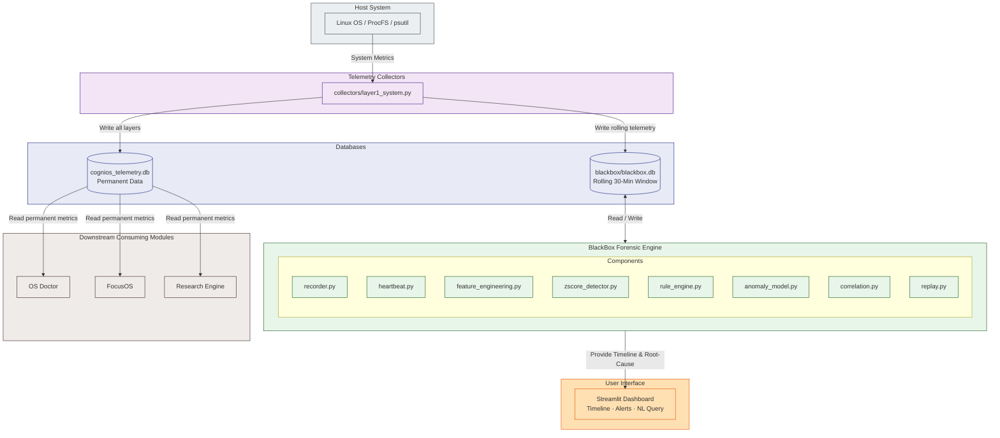

# BlackBox Module — CogniOS

> **"Airplane ka black box"** — continuously record karta rehta hai, crash/freeze ke baad replay karke batata hai exactly kya hua tha aur kyun.

---

## 1. Module Overview

BlackBox is CogniOS's **flight recorder and forensic analysis engine**. It answers one core question:

> _"My system froze/crashed — what happened in the 30 minutes before it?"_

### What BlackBox is

- A real-time telemetry recorder (rolling 30-minute window)
- An anomaly detection engine (Z-score + Isolation Forest)
- A root-cause explanation system (Correlation Engine + LLM)

### Core pipeline

```
Layer 1/2/3/4 Telemetry
        ↓
Rolling Event Store (last 30 min only)
        ↓
Heartbeat System (crash/freeze detection)
        ↓
Feature Engineering (120 rows → 1 feature vector)
        ↓
Z-score Detector (sudden spikes + slow drift)
        ↓
Isolation Forest (multi-metric anomaly confirmation)
        ↓
Rule Engine (deterministic backup checks)
        ↓
Correlation Engine (CAUSE → EFFECT chain)
        ↓
Replay Timeline
        ↓
LLM Explanation (human-readable root cause)
        ↓
Dashboard Alert
```

---

## 2. File Structure

```
blackbox/
├── recorder.py               # Rolling event store — writes + prunes telemetry
├── heartbeat.py               # Crash/freeze detection via heartbeat timestamps
├── feature_engineering.py    # Converts raw DB rows → statistical feature vector
├── zscore_detector.py        # Z-score + slope (trend) based anomaly detector
├── anomaly_model.py          # Isolation Forest wrapper (sklearn)
├── rule_engine.py            # Deterministic threshold-based checks (backup)
├── correlation.py            # Builds CAUSE → EFFECT event chains
├── replay.py                  # Reconstructs timeline from rolling window
├── nl_query.py                # Natural language query interface (placeholder)
├── crash_predictor_cnn.py     # CNN-based sequence classifier (placeholder)
├── test_integration.py       # 13-section end-to-end test suite
├── collect_training_data.py  # Background collector for real-usage feature vectors
├── train_from_real_data.py   # Trains Isolation Forest from collected real data
└── blackbox.db                # SQLite DB (rolling 30-min window), WAL mode
```

```
CogniOS/                       # project root
├── config.py                  # All config constants, including BlackBox's
├── db.py                      # SQLite connection + schema for Layer 1/2
└── cognios_as_daemon.py       # Daemon entry point, wires BlackBox into main loop
```

> **Note:** `config.py` and `db.py` live at the project root, not under a
> `utils/` package — every BlackBox module imports them as `from config import
...` / `from db import ...`.

---

## 3. Function & Class Definitions

### `recorder.py`

```python
def get_blackbox_conn() -> sqlite3.Connection
```

**Purpose:** Opens and returns a connection to `blackbox/blackbox.db` in WAL mode with synchronous set to NORMAL for crash-safe, fast writes. Registers a `threading.Lock` per connection so concurrent reads/writes (daemon + any other thread) are safe.

- **Input:** None
- **Output:** `sqlite3.Connection`

```python
def create_blackbox_table(conn: sqlite3.Connection) -> None
```

**Purpose:** Creates the rolling `blackbox_telemetry` table schema (for CPU, Memory, Disk, Network, Processes, and Hardware temperatures) if it doesn't already exist.

- **Input:** `conn` (sqlite3 connection)
- **Output:** None

```python
def write_telemetry(conn: sqlite3.Connection, metrics: dict) -> None
```

**Purpose:** Writes one Layer 1 metrics dictionary row into `blackbox_telemetry`. Inserts current time if timestamp is missing. Triggers database pruning (`prune_old_records`) every 60 writes (batched, not on every write, to reduce `DELETE` overhead).

- **Input:** `conn`, `metrics` (dict)
- **Output:** None

```python
def prune_old_records(conn: sqlite3.Connection) -> None
```

**Purpose:** Deletes telemetry rows older than `BLACKBOX_WINDOW_SEC` (default: 30 minutes) to maintain the rolling window.

- **Input:** `conn`
- **Output:** None

```python
def get_recent_rows(conn: sqlite3.Connection, n: int = 120) -> list[dict]
```

**Purpose:** Fetches the last `n` telemetry rows (default 120 = last 2 minutes), returning them in chronological order. Useful for feature engineering or correlation analysis.

- **Input:** `conn`, `n` (int)
- **Output:** `list[dict]`

```python
def get_window_rows(conn: sqlite3.Connection, start_time: float, end_time: float) -> list[dict]
```

**Purpose:** Fetches and returns all telemetry rows between two Unix epoch timestamps.

- **Input:** `conn`, `start_time` (float), `end_time` (float)
- **Output:** `list[dict]` ordered chronologically

```python
def row_count(conn: sqlite3.Connection) -> int
```

**Purpose:** Returns the total number of rows currently stored in `blackbox_telemetry`.

- **Input:** `conn`
- **Output:** `int`

---

### `heartbeat.py`

```python
def create_heartbeat_table(conn: sqlite3.Connection) -> None
```

**Purpose:** Creates a single-row table `blackbox_heartbeat` to store the last heartbeat timestamp and a graceful shutdown flag.

- **Input:** `conn`
- **Output:** None

```python
def update_heartbeat(conn: sqlite3.Connection) -> None
```

**Purpose:** Updates the `last_beat` column with the current timestamp. Called by the daemon loop every second.

- **Input:** `conn`
- **Output:** None

```python
def mark_graceful_shutdown(conn: sqlite3.Connection) -> None
```

**Purpose:** Sets the `graceful_shutdown` flag to `1` in the heartbeat table. Called in the daemon's SIGTERM/SIGINT handler to indicate a clean exit. If not called (crash, SIGKILL, power cut), the flag stays `0` — this is how a crash is distinguished from a normal shutdown.

- **Input:** `conn`
- **Output:** None

```python
def check_crash_on_startup(conn: sqlite3.Connection) -> tuple[bool, float]
```

**Purpose:** Called once at daemon startup. Reads the last heartbeat timestamp and the graceful shutdown flag. Returns `(crash_detected: bool, gap_seconds: float)`.

**Detection logic (priority order):**

1. `graceful_shutdown == 1` → normal shutdown, no crash — regardless of gap size (so a slow boot or laptop sleep doesn't get misread as a crash)
2. `graceful_shutdown == 0` AND `gap > BLACKBOX_CRASH_GAP_SEC` → crash detected (this gap check is a fallback for SIGKILL/power-cut cases where the flag never gets set)
3. Always resets the flag to `0` for the next session

- **Input:** `conn`
- **Output:** `(crash_detected, gap_seconds)`

---

### `feature_engineering.py`

```python
def extract_feature_vector(rows: list[dict]) -> list[float] | None
```

**Purpose:** Converts the last 120 raw telemetry rows into a single 8-dimensional statistical feature vector for anomaly detection.

- **Input:** `rows` (list of dicts, minimum `BLACKBOX_WARMUP_SEC` = 60 rows required)
- **Output:** `[mean_cpu, max_cpu, cpu_growth_rate, cpu_variance, mean_ram, memory_growth_rate, disk_spike_frequency, context_switch_rate]`. Returns `None` if data is insufficient.

`cpu_growth_rate` and `memory_growth_rate` are `newest - oldest` deltas within
the window — positive means the metric rose over the window, negative means
it fell.

---

### `zscore_detector.py`

```python
class ZScoreDetector:
```

**Purpose:** Sliding-window statistical detector that monitors metric streams for sudden spikes and slow drifts.

- **Methods:**
  - `__init__(self)`: Initializes the rolling baseline deques for Z-score calculation, slope calculation, and sustained spike filtering.
  - `update(self, val)`: Appends a new metric reading to the internal deques.
  - `warmup_pct(self)`: Returns calibration progress (0–100%).
  - `check(self, val, metric_name="metric", unit="%") -> list[dict]`: Checks for:
    - **Z-score spike:** Flags values exceeding `Z > 2.8`, only if also sustained (≥60% of the last 30s of readings above `mean + 2·std`) — sudden compile-burst-style spikes that don't sustain are filtered out.
    - **Slow drift:** Calculates the trend slope via linear regression. Flags slow drifts (e.g. memory leaks) and predicts `ETA to critical` in minutes.

---

### `anomaly_model.py`

```python
def train(normal_feature_vectors: list[list[float]], contamination: float = 0.05) -> IsolationForest
```

**Purpose:** Trains an Isolation Forest on normal baseline feature vectors.

- **Input:** `normal_feature_vectors` (list of feature lists), `contamination` (expected anomaly ratio)
- **Output:** Trained `IsolationForest` object

```python
def predict(model: IsolationForest, feature_vector: list[float]) -> tuple[int, float]
```

**Purpose:** Predicts if a feature vector is normal (`1`) or anomalous (`-1`), returning the label and raw decision score.

- **Input:** `model` (IsolationForest), `feature_vector` (list of 8 floats)
- **Output:** `(label, score)`

```python
def anomaly_severity(score: float) -> int
```

**Purpose:** Converts the raw Isolation Forest decision score (negative = more anomalous) to a normalized `0–100` severity integer for the dashboard.

- **Input:** `score` (float)
- **Output:** `int`

```python
def save_model(model: IsolationForest, path: str = MODEL_PATH) -> None
```

**Purpose:** Serializes and saves the trained model to disk using pickle.

- **Input:** `model` (IsolationForest), `path` (str, default `blackbox/if_model.pkl`)
- **Output:** None

```python
def load_model(path: str = MODEL_PATH) -> IsolationForest
```

**Purpose:** Loads a saved model from disk. Raises `FileNotFoundError` if no model has been trained yet — the daemon catches this and falls back to rule engine + Z-score only.

- **Input:** `path` (str)
- **Output:** `IsolationForest`

---

### `rule_engine.py`

```python
def check_rules(metrics: dict) -> list[dict]
```

**Purpose:** Runs deterministic threshold checks (CPU, Memory, Zombies, Temperature, Swap) alongside the ML models. Runs from tick 1 — fills the gap during the model warmup period, when Z-score and Isolation Forest don't yet have enough history.

- **Input:** `metrics` (dict — the live Layer 1 metrics dict, not a stored DB row)
- **Output:** `list[dict]` of fired alerts, each with `type`, `severity`, `value`, and `message` keys

---

### `correlation.py`

```python
def telemetry_to_events(rows: list[dict]) -> list[dict]
```

**Purpose:** Analyzes consecutive telemetry rows and creates events (`cpu_spike`, `memory_growth`, `process_explosion`, `zombie_buildup`, `io_storm`, `swap_spike`) when thresholds are breached.

- **Input:** `rows` (list of dicts)
- **Output:** `list[dict]` of events, each carrying both a formatted `time` string and a numeric `timestamp`

```python
def build_event_chain(events: list[dict]) -> list[dict]
```

**Purpose:** Deduplicates and groups same-type events occurring within 5 seconds of each other to construct a clean cause-effect event chain.

- **Input:** `events` (list of dicts)
- **Output:** `list[dict]` (chronological event chain)

```python
def format_chain_text(chain: list[dict]) -> str
```

**Purpose:** Formats the event chain into a clean, human-readable timeline string.

- **Input:** `chain` (list of dicts)
- **Output:** `str`

---

### `replay.py`

```python
def replay(conn, crash_time: float = None, window_minutes: int = 30) -> dict
```

**Purpose:** Reconstructs the pre-crash system state by fetching telemetry rows, converting them to events, building the event chain, and formatting the timeline.

- **Input:** `conn` (sqlite3 connection), `crash_time` (Unix timestamp float, defaults to now), `window_minutes` (int)
- **Output:** `dict` containing crash details and timeline text

```python
def generate_llm_context(replay_result: dict, anomaly_type: str = "unknown") -> dict
```

**Purpose:** Creates a context dictionary containing a formatted prompt, timeline, and anomaly metadata to feed into an LLM for explanation generation.

- **Input:** `replay_result` (dict), `anomaly_type` (str)
- **Output:** `dict`

---

### `collect_training_data.py`

```python
def collect_and_append(conn) -> bool
```

**Purpose:** Extracts one feature vector from the most recent 120 rows and appends it (with a timestamp) to `blackbox/training_vectors.jsonl` — a file that is never pruned, so it accumulates across sessions and days unlike `blackbox_telemetry`. Returns `False` (writes nothing) during warmup.

- **Input:** `conn`
- **Output:** `bool`

Run alongside the daemon to build a real-usage training set for
`anomaly_model.py`, as an alternative or supplement to synthetic `stress-ng`
data:

```bash
python3 -m blackbox.collect_training_data
```

---

### `train_from_real_data.py`

**Purpose:** Loads all vectors from `blackbox/training_vectors.jsonl`, trains
the Isolation Forest via `anomaly_model.train()`, saves it to
`blackbox/if_model.pkl`, and runs a sanity check (predicts on its own
training data — the anomalous fraction should land near the requested
`contamination`, e.g. ~5%).

```bash
python3 -m blackbox.train_from_real_data
```

---

### `nl_query.py` & `crash_predictor_cnn.py`

- **Status:** Placeholder drafts (docstring only, no active runtime
  functions). `nl_query.py` is planned to accept a free-text question and
  return an LLM-generated answer built from `replay()`/`correlation.py`
  output. `crash_predictor_cnn.py`'s scope is not yet defined — needs
  clarification before implementation starts, since it overlaps
  conceptually with `anomaly_model.py`.

---

## 4. Useful Telemetry Data

BlackBox consumes data from all 4 collector layers:

### From `layer1_system` (Layer 1 — every 1s)

| Column              | Use in BlackBox                                                                          |
| ------------------- | ---------------------------------------------------------------------------------------- |
| `cpu_usage_percent` | Primary Z-score metric, spike detection                                                  |
| `memory_percent`    | Memory leak slope detection                                                              |
| `disk_read`         | I/O storm detection                                                                      |
| `net_rate_mb_s`     | Network exfiltration detection                                                           |
| `cpu_ctx_switches`  | Scheduler congestion (feature vector)                                                    |
| `total_processes`   | Thread explosion detection                                                               |
| `zombie_processes`  | Zombie accumulation rule check                                                           |
| `load_avg1`         | Scheduler load feature                                                                   |
| `swap_percent`      | Memory pressure feature                                                                  |
| `avg_temp`          | Stored in `blackbox_telemetry`                                                           |
| `max_temp`          | Read live by `rule_engine.py` for thermal alerts (not persisted to `blackbox_telemetry`) |

### From `layer2_top_processes` (Layer 2 — every 5s)

| Column        | Use in BlackBox                                |
| ------------- | ---------------------------------------------- |
| `pid`, `name` | Identify culprit process in correlation engine |
| `cpu_percent` | Which process caused CPU spike                 |
| `rss_memory`  | Which process is leaking memory                |
| `timestamp`   | Timeline correlation                           |

### From `process_metadata` (Layer 3 — on first seen)

| Column        | Use in BlackBox                        |
| ------------- | -------------------------------------- |
| `cmdline`     | What exact command was running         |
| `exe_path`    | Where executable came from             |
| `username`    | Who launched the process               |
| `create_time` | When process started relative to crash |

### From `process_diagnostics` (Layer 4 — on anomaly)

| Column             | Use in BlackBox                          |
| ------------------ | ---------------------------------------- |
| `open_files_count` | File handle leak detection               |
| `thread_details`   | Which threads were consuming CPU         |
| `net_connections`  | Active network connections at crash time |
| `trigger_reason`   | Why Layer 4 was triggered                |

### Rolling window SQL

```sql
-- Fetch last 2 minutes for feature extraction
SELECT cpu_usage_percent, memory_percent,
       disk_read, net_rate_mb_s,
       total_processes, cpu_ctx_switches
FROM blackbox_telemetry
ORDER BY timestamp DESC
LIMIT 120;

-- Trim to 30-minute window
DELETE FROM blackbox_telemetry
WHERE timestamp < (strftime('%s', 'now') - 1800);
```

---

## 5. Additional Info & Configuration

### Config values (from `config.py`, project root)

```python
# Database configuration
BLACKBOX_DB_PATH         = "blackbox/blackbox.db"

# Window & warmup configuration
BLACKBOX_WINDOW_SEC      = 1800   # Rolling window duration (30 mins)
BLACKBOX_WARMUP_SEC      = 60     # Seconds of data required before detection starts
BLACKBOX_CRASH_GAP_SEC   = 30     # Fallback gap threshold for crash detection (SIGKILL cases only)

# Z-Score detector tunables
BLACKBOX_Z_THRESHOLD     = 2.8    # Standard deviations for spike detection
BLACKBOX_SLOPE_THRESHOLD = 0.003  # %/sec rise threshold for slow drift detection
BLACKBOX_SUSTAINED_SEC   = 30     # Duration a spike must be sustained
BLACKBOX_SUSTAINED_RATIO = 0.6    # Fraction of readings that must cross threshold
BLACKBOX_TREND_WINDOW    = 600    # History length (10 min) for slope calculation

# Rule engine critical thresholds
BLACKBOX_CPU_CRITICAL    = 90.0   # %
BLACKBOX_MEM_CRITICAL    = 90.0   # %
BLACKBOX_ZOMBIE_LIMIT    = 10     # count
BLACKBOX_TEMP_CRITICAL   = 85.0   # °C
BLACKBOX_SWAP_CRITICAL   = 80.0   # %

# Daemon
ANOMALY_CHECK_INTERVAL_SEC = 120  # How often the daemon runs an Isolation Forest check
```

### Key design decisions

**Why SQLite over other storage?**
Lightweight, local, crash-resistant (data survives daemon crash via WAL mode), queryable via SQL, replay-friendly.

**Why rolling 30-minute window?**
30 minutes of pre-crash context is sufficient for root-cause analysis. Longer window = more disk usage with diminishing returns.

**Why Isolation Forest and not a supervised model?**
No labeled anomaly dataset exists initially. IF is unsupervised — trained on normal data only, no labels needed.

**Why Z-score threshold 2.8 and not 3.0?**
At 3.0, a developer's laptop (higher baseline CPU) barely crosses the threshold for genuine spikes. 2.8 gives slightly better sensitivity while keeping false positives low, thanks to the sustained-spike filter.

**Why a graceful-shutdown flag instead of a fixed gap threshold for crash detection?**
A fixed gap (e.g. "crash if gap > 10s") is arbitrary and system-dependent — slow-boot systems (HDD, laptop sleep) can produce large gaps on a completely normal restart, causing false positives. The flag is binary and unambiguous: if it's set, the last shutdown was clean regardless of gap size. The gap threshold (`BLACKBOX_CRASH_GAP_SEC`) is kept only as a fallback for SIGKILL/power-loss cases, where the flag can never get set.

---

## 6. Architecture Diagram


```mermaid
graph TB
    %% Nodes & Relationships
    subgraph Host [Host System]
        Linux[Linux OS / ProcFS / psutil]
    end

    subgraph Collectors [Telemetry Collectors]
        Col1[collectors/layer1_system.py]
    end
    Linux -->|System Metrics| Col1

    subgraph Storage [Databases]
        DB_Cog[(cognios_telemetry.db<br>Permanent Data)]
        DB_BB[(blackbox/blackbox.db<br>Rolling 30-Min Window)]
    end

    Col1 -->|Write all layers| DB_Cog
    Col1 -->|Write rolling telemetry| DB_BB

    subgraph BB [BlackBox Forensic Engine]
        subgraph Components [Components]
            rec[recorder.py]
            hb[heartbeat.py]
            fe[feature_engineering.py]
            zs[zscore_detector.py]
            re[rule_engine.py]
            am[anomaly_model.py]
            co[correlation.py]
            rep[replay.py]
        end
    end

    DB_BB <-->|Read / Write| BB

    subgraph Clients [Downstream Consuming Modules]
        OSD[OS Doctor]
        FOS[FocusOS]
        RE[Research Engine]
    end
    DB_Cog -->|Read permanent metrics| OSD
    DB_Cog -->|Read permanent metrics| FOS
    DB_Cog -->|Read permanent metrics| RE

    subgraph Dashboard [User Interface]
        SD[Streamlit Dashboard<br>Timeline · Alerts · NL Query]
    end
    BB -->|Provide Timeline & Root-Cause| SD

    %% Styling
    classDef sys fill:#eceff1,stroke:#37474f,stroke-width:1px;
    classDef collector fill:#f3e5f5,stroke:#4a148c,stroke-width:1px;
    classDef storage fill:#e8eaf6,stroke:#1a237e,stroke-width:1px;
    classDef engine fill:#e8f5e9,stroke:#1b5e20,stroke-width:1px;
    classDef client fill:#efebe9,stroke:#3e2723,stroke-width:1px;
    classDef ui fill:#ffe0b2,stroke:#e65100,stroke-width:1px;

    class Host,Linux sys;
    class Collectors,Col1 collector;
    class Storage,DB_Cog,DB_BB storage;
    class BB,rec,hb,fe,zs,re,am,co,rep engine;
    class Clients,OSD,FOS,RE client;
    class Dashboard,SD ui;
```

### Why two separate databases?

| `cognios_telemetry.db`                      | `blackbox/blackbox.db`                |
| ------------------------------------------- | ------------------------------------- |
| Permanent — never pruned                    | Rolling window — last 30 min only     |
| All Layer 1/2/3/4 data                      | Only BlackBox-relevant metrics        |
| Read by OS Doctor, FocusOS, Research Engine | Read only by BlackBox                 |
| Grows indefinitely                          | Max ~1800 rows (1 per second × 1800s) |

---

## 7. How to Run

### Prerequisites

```bash
pip install psutil numpy scikit-learn
```

### First-time setup

```bash
cd CogniOS

python3 -c "
import sys
sys.path.insert(0, '.')
from blackbox.recorder import get_blackbox_conn, create_blackbox_table
from blackbox.heartbeat import create_heartbeat_table

conn = get_blackbox_conn()
create_blackbox_table(conn)
create_heartbeat_table(conn)
print('BlackBox DB initialised at blackbox/blackbox.db')
"
```

### Run full daemon

```bash
python3 cognios_as_daemon.py
```

Wires in `check_rules()`, `ZScoreDetector`, and — if `blackbox/if_model.pkl`
exists — Isolation Forest predictions every `ANOMALY_CHECK_INTERVAL_SEC`. If
no trained model is found, the daemon logs that and continues with rule
engine + Z-score only, rather than failing.

### Run BlackBox integration test only

```bash
python3 -m blackbox.test_integration
```

13 sections covering DB setup, heartbeat/crash detection, telemetry
read/write/prune, a 70-cycle warmup + detection run, feature vector
validation, rule engine, correlation, replay, and the full Isolation Forest
train/predict/save/load cycle.

### Training the Isolation Forest — two approaches

**Option A — synthetic data via `stress-ng`:**

```bash
sudo apt install stress-ng
python3 cognios_as_daemon.py &

stress-ng --cpu 8 --timeout 60s              # cpu_overload
sleep 30
stress-ng --vm 4 --vm-bytes 80% --timeout 60s   # memory_pressure
sleep 30
stress-ng --hdd 4 --timeout 60s             # disk_io_stress
sleep 30
stress-ng --pthread 100 --timeout 60s       # thread_explosion
```

**Option B — real usage data (recommended for the final model):**

```bash
# Terminal 1
python3 cognios_as_daemon.py

# Terminal 2 — run during normal usage, stop/resume across sessions as needed
python3 -m blackbox.collect_training_data
```

Once enough data has accumulated (a few hours at minimum, ideally spread
across multiple sessions to capture varied usage patterns):

```bash
python3 -m blackbox.train_from_real_data
```

Both approaches produce a `blackbox/if_model.pkl` that `anomaly_model.load_model()`
and the daemon can pick up. A hybrid approach — bootstrapping with synthetic
data, then retraining periodically on accumulated real data — is a
reasonable middle ground.

---

## 8. Improvements & Future Work

### High priority (low effort)

**Continuous anomaly severity score:**
Already implemented via `anomaly_severity()` — worth surfacing on the
dashboard as a gradual escalation (40→60→80→100) rather than a sudden binary
alert.

### Medium priority

**Per-metric Isolation Forest models:**
One combined model learns a confused boundary across all metrics. Separate models per metric with different `contamination` rates may give better detection accuracy.

**Exponential Moving Average (EMA) baseline:**
Replace the simple rolling mean in `ZScoreDetector` with EMA for faster adaptation to regime changes, reducing false positives when the user starts a new heavy workload.

**`nl_query.py` implementation:**
The underlying pieces (`replay()`, `correlation.py`) are done and tested; this is a UX layer on top — natural-language question in, LLM-generated answer out.

### Low priority (research phase)

**LSTM Autoencoder hybrid:**
LSTM captures temporal dependencies that Isolation Forest cannot — sequential patterns like memory growing over 2 hours. A hybrid approach (LSTM reconstruction error fed into Isolation Forest) could improve detection. Requires TensorFlow and more training data.

**`crash_predictor_cnn.py` scope:**
Not yet defined. Needs a decision on whether this is a planned CNN-based
predictor layered on top of (or replacing) the Isolation Forest, before
implementation starts.

### Known limitations

| Limitation                                     | Impact                                                                                   | Workaround / Status                                                                                                                                                               |
| ---------------------------------------------- | ---------------------------------------------------------------------------------------- | --------------------------------------------------------------------------------------------------------------------------------------------------------------------------------- |
| Z-score slow drift blind spot                  | Memory leaks over 2+ hours may not trigger                                               | Slope detector partially covers this                                                                                                                                              |
| IF needs warmup data                           | No anomaly detection for first 60s of a session                                          | Rule engine covers the warmup period                                                                                                                                              |
| `stress-ng` training data is synthetic         | Real anomalies may differ from synthetic ones                                            | Real-usage data collection pipeline now available (`collect_training_data.py` + `train_from_real_data.py`)                                                                        |
| SIGKILL bypasses the graceful-shutdown flag    | Gap fallback may miss very fast restarts                                                 | `BLACKBOX_CRASH_GAP_SEC = 30` as buffer                                                                                                                                           |
| Feature-engineering growth-rate sign inversion | Fixed — a double-reversal bug previously inverted `cpu_growth_rate`/`memory_growth_rate` | Fixed in `feature_engineering.py`. **Any `if_model.pkl` trained before this fix was trained on inverted-sign data for these two features and should be retrained on fresh data.** |
| `write_layer1`'s exact signature in `db.py`    | Daemon's call to it must stay in sync with `db.py`'s positional-arg list                 | Currently synced; watch for drift on future `db.py` changes                                                                                                                       |
