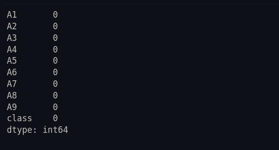
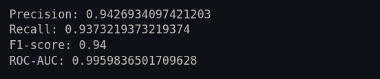
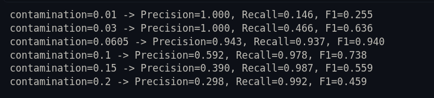
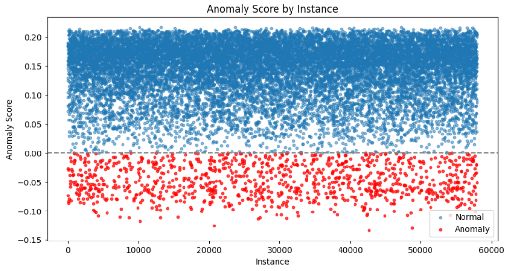

# Isolation Forest for Anomaly Detection - Shuttle Dataset

## About the Dataset

I downloaded the Shuttle dataset from OpenML in `.arff` format.

The dataset have 58,000 rows and 9 numeric features (A1 to A9). There is no missing values in this
data, I checked and got 0 everywhere.

The tricky part was that this dataset originally have 7 classes (1 to 7), so it is actually a
multi-class classification dataset, not a ready made anomaly detection dataset. Since the task
need anomaly detection, I had to convert it into binary labels myself.

Class distribution was like this:

I noticed that class 1 and class 4 are together almost 94% of all data, so these looks like normal
/ common operating states of the shuttle. The other classes (2,3,5,6,7) are very small in number
(only 10 to 3267), so these looks more like rare/anomaly events.

So I decided:

- class 1 and class 4 = normal (0)
- class 2,3,5,6,7 = anomaly (1)

This gives anomaly rate of around **6.05%** which is a good realistic rate for anomaly detection
problems (anomalies are always supposed to be small % of data).

I also thought if I only take class 1 as normal and make class 4 also anomaly, then anomaly rate
becomes almost 21% which is too high to be called "anomaly" realistically. So I stuck with my
first choice.

## My Approach

1. Load the `.arff` file using `scipy.io.arff` (normal pandas read_csv doesn't work on arff files)
2. Check for missing values - found none
3. The `class` column was coming in bytes format like `b'1'` because of how arff files load, so I
   had to decode it using `.str.decode('utf-8')` and convert to int
4. Made the binary `label` column as explained above
5. Selected the 9 feature columns (A1-A9) as X, and label as y (y is only used later for checking
   results, not for training, since Isolation Forest doesn't need labels to train)
6. Split data into train (70%) and test (30%) using stratify so both sets have same anomaly ratio
7. Trained the Isolation Forest model
8. Predicted anomalies on test set
9. Evaluated using precision, recall, f1 and roc-auc
10. Did some experiments changing contamination values

## Parameters Used

**n_estimators = 100**
This means how many trees the forest will build. More trees = more stable and reliable average
score, but after some point adding more trees doesn't help much and just take more time. 100 is
what the original paper also suggest as a good default.

**max_samples = 256**
This is how many random samples each tree get trained on. It doesn't need full dataset to find
anomalies - even a small random sample is enough because anomaly points stand out even in small
groups. So keeping it small also make training faster.

**contamination = 0.0605**
This tells model what % of data we expect to be anomaly. I used the actual anomaly rate that I
calculated from the true labels. In real life situation we usually don't know this exact number,
we have to guess it, but since I had labels available I could use the exact value.

## Evaluation Results

After training and predicting on test data, these are the results I got:

## Experiments

### Changing contamination value

I tried different contamination values to see how it changes the results:

**What I observed:** when contamination is very low (0.01), the precision is perfect (1.000) but
recall is very bad (0.146). This is because model becomes very strict and only flag the most
obvious anomalies, so whatever it flags is correct but it misses a lot of actual anomalies.

When contamination is high (0.2), it is opposite - recall becomes very good (0.992) but precision
drops a lot (0.298), because now model is flagging too many points as anomaly, including many
normal ones by mistake.

The best F1 score came at contamination=0.0605, which is basically the real anomaly rate in the
data. This make sense because that's where the threshold is most "correctly" placed, not too
strict and not too loose.

## Scatter plot

